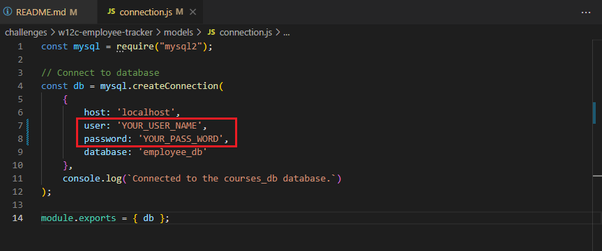

# Employee Tracker

## Description

This app is a command-line CMS application to view and manage Employee Database in a company, which includes departments, roles and employees.

## Table of Contents
  - [Installation](#installation)
  - [Features](#features)
  - [Usage](#usage)
  - [Walkthrough-Video](#walkthrough-video)
  - [Questions](#questions)

## Features

```
User will be able to:

* View all departments, roles, and employees
* Add a department, a role, an employee, and update an employee role
* Delete a departmen, a role and an employee
* Update employee managers
* View employees by manager
* View employees by department
* View the total utilized budget of a department
```
## Usage

```
Before using, you need to change mysql username and password:
* models/connection.js
```


## Walkthrough-Video

Please follow the walk-through video below.

- [Walking-through video for README application](https://drive.google.com/file/d/182-JynirH2tO-dPBYFoG6wExYLYCBMXe/view)

## Questions
If you have any questions about the repo, open an issue or contact me directly at odthientho@gmail.com. You can find more of my works at [odthientho](https://github.com/odthientho/).